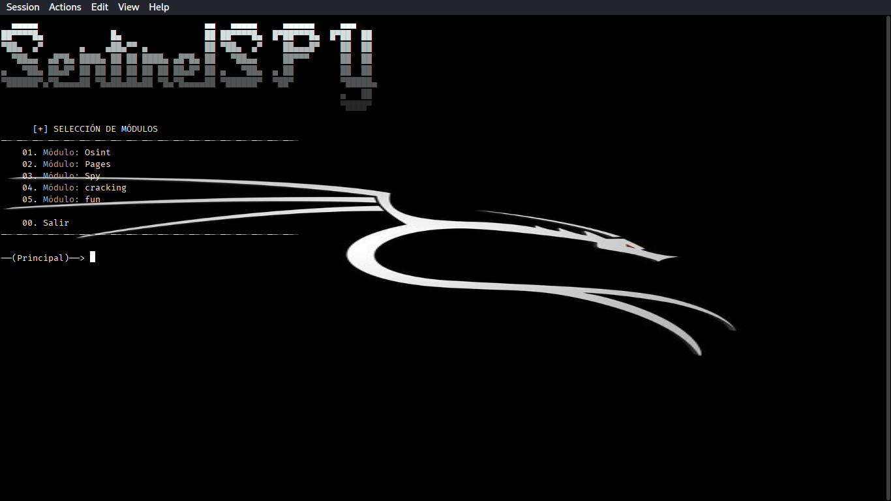

# SentinelSPY


## 📦 instalacion

1. **Clonar el repositorio:**
   ```bash
   git clone https://github.com/The2GrayHat/FTI
   
   cd FTI

2. **instalar requerimientos**
   ```bash
   pip install -r requirements # en caso de ser linux añadir al final --break-system-packages

3. **ejecutar**
   ```bash
   python SentinelSPY.py
